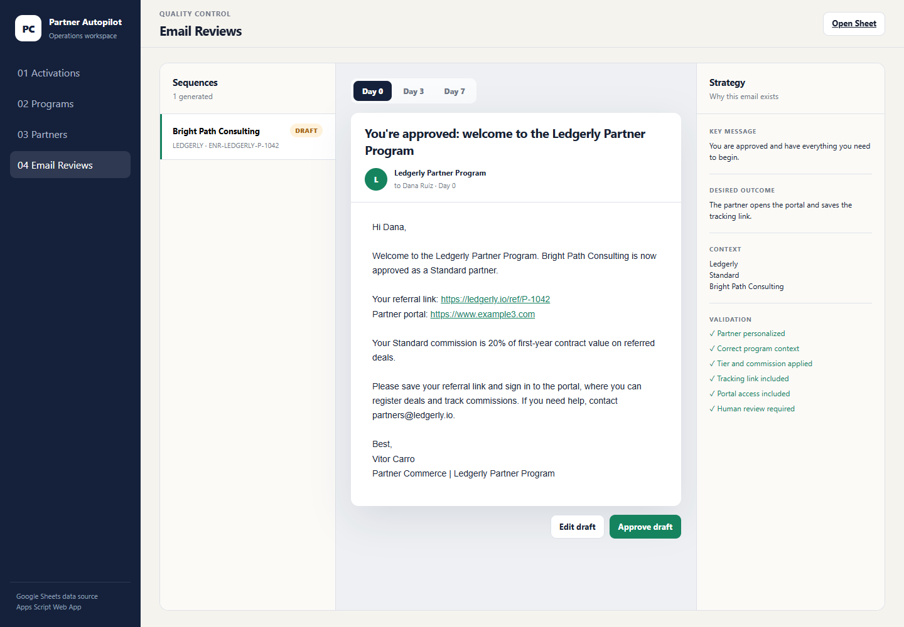
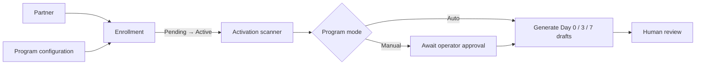

# Partner Onboarding Autopilot

A working Google Apps Script prototype that turns a partner approval into a reviewable Day 0 / Day 3 / Day 7 onboarding sequence.

The exercise asks for the logic behind the automation and the message strategy. This implementation keeps those two things visible: Google Sheets is the simulated operational source, Apps Script detects activation events and generates drafts, and the web app gives an operator a clear place to review the result.

[Open the live demo](https://script.google.com/macros/s/AKfycbxdFvDc9Y8aTDCJowWKpH2dyBqKkL3bO-Zp0x61E59_4xTV3P0fcQJ4X6VLoFQX40KP9A/exec)



## What the prototype demonstrates

- A partner's status is scoped to a program through an `Enrollment`.
- A five-minute trigger can scan for new `ACTIVE` enrollments; **Run Scan Now** makes the demo immediate.
- `AUTO` programs draft sequences on detection.
- `MANUAL` programs place the activation in a review queue before drafting.
- Every activation event is idempotent: the same enrollment/status-change date cannot create duplicate sequences.
- Program details, commission tiers, resources, brand voice, and sequence strategy are editable.
- Partners can be added, archived, and approved for different programs and tiers.
- Generated emails have a realistic preview plus an explicit key message and desired outcome.
- Drafts remain human-reviewable. This prototype deliberately does not send email.

## Product walkthrough

The web app has four separate work areas:

1. **Activations** — monitor the trigger, switch Auto/Manual processing, run a scan, and simulate a Pending → Active transition.
2. **Programs** — manage the context that drives generated content: voice, tracking template, tiers, resources, and Day 0/3/7 goals.
3. **Partners** — manage partner records and program-specific memberships.
4. **Email Reviews** — inspect the full sequence, switch between days, validate personalization, edit, and approve drafts.


## The core decision

The unit of automation is not the partner record. It is the partner's **enrollment in a specific program**.



That separation lets one partner participate in multiple client programs with different approval statuses, tiers, links, and onboarding content.

## Email strategy

| Step | Key message | Desired outcome |
| --- | --- | --- |
| Day 0 | You are approved and have everything you need to begin. | Open the portal and save the tracking link. |
| Day 3 | The fastest path to activation is one well-matched registered opportunity. | Identify and register a first potential deal. |
| Day 7 | Lead with the finance team's workflow challenge, not a product pitch. | Position Ledgerly credibly and ask for help if blocked. |

The sequence moves from **access → first action → confident positioning**. More detail is in [docs/email-strategy.md](docs/email-strategy.md).

## Local development

Requirements:

- Node.js 20+
- a Google account for Apps Script deployment

```bash
pnpm install
pnpm run check
pnpm run preview
```

The local preview uses `dev/mock-state.json`; it exercises the same HTML/CSS/JS without requiring Google authorization.

## Apps Script deployment

```bash
pnpm exec clasp login
pnpm exec clasp create-script --title "Partner Onboarding Autopilot" --type standalone --rootDir src
pnpm run clasp:push
```

To connect an existing Apps Script project instead, copy `.clasp.example.json` to `.clasp.json` and replace the placeholder `scriptId`.

In the Apps Script editor:

1. Run `setupDemoSpreadsheet()` once and authorize it.
2. Run `installScheduledTrigger()` once to create the five-minute scanner.
3. Deploy → New deployment → Web app.
4. Execute as yourself and choose the access level appropriate for the demo.

See [docs/setup.md](docs/setup.md) for the full setup and demo path.

## Repository map

```text
src/
  Code.gs                 Web app entry points
  SetupService.gs         Sheet creation and exercise seed data
  Repository.gs           Sheet persistence helpers
  OnboardingService.gs    Detection, idempotency, and draft workflow
  EmailGenerator.gs       Deterministic Day 0 / 3 / 7 generation
  ProgramService.gs       Program configuration operations
  PartnerService.gs       Partner and enrollment operations
  TriggerService.gs       Five-minute scheduled scan
  Index.html              Web app shell
  Styles.html             Interface system
  App.html                Client-side pages and interactions
docs/
  architecture.md
  data-model.md
  email-strategy.md
  setup.md
```

## Scope

This is a high-fidelity take-home prototype, not a production partner platform. It omits real email delivery, authentication, CRM/Impact integrations, and enterprise permissions. The interfaces around those boundaries are intentionally clear so they can be added without changing the core model.
