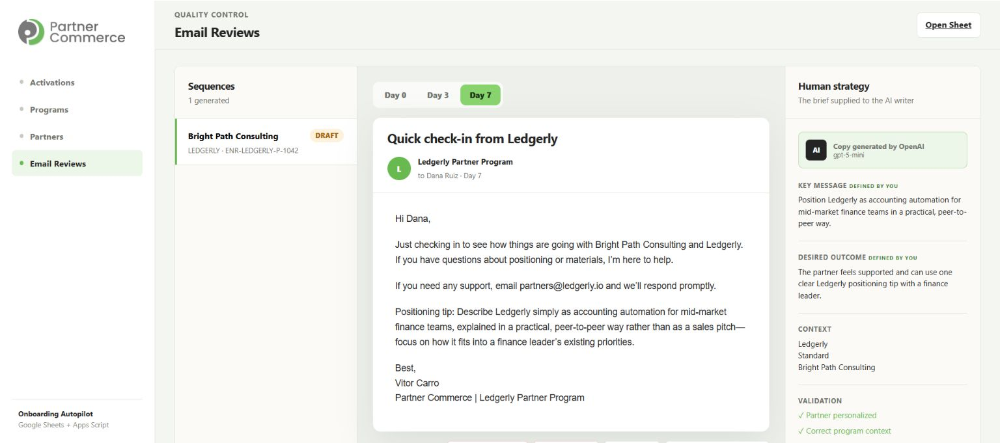
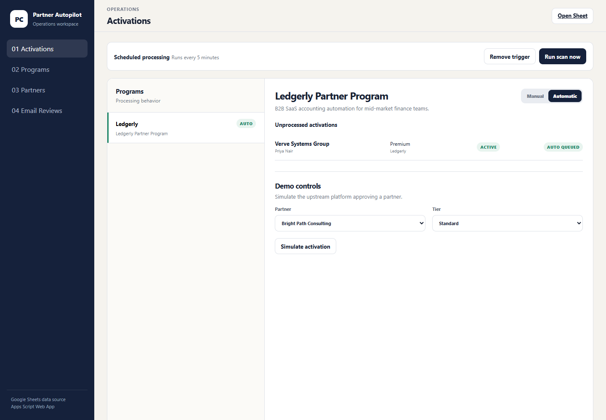
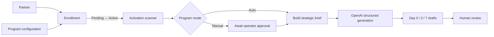

# Partner Onboarding Autopilot

A working Google Apps Script prototype that turns a partner approval into a reviewable Day 0 / Day 3 / Day 7 onboarding sequence.

The exercise asks for the logic behind the automation and the message strategy. This implementation keeps those two things visible: Google Sheets is the simulated operational source, Apps Script detects activation events, and OpenAI turns a human-authored sequence blueprint into personalized drafts. The web app keeps every draft reviewable before sending.

[Open the live demo](https://script.google.com/macros/s/AKfycbwAqD8KHJiUHngQZtNQ5BLjgBacQLkm1e-jXnfLzqzpj_W3G8mMYHiuA03-ICOqli5seg/exec)



## What the prototype demonstrates

- A partner's status is scoped to a program through an `Enrollment`.
- A five-minute trigger can scan for new `ACTIVE` enrollments; **Run Scan Now** makes the demo immediate.
- `AUTO` programs draft sequences on detection.
- `MANUAL` programs place the activation in a review queue before drafting.
- Every activation event is idempotent: the same enrollment/status-change date cannot create duplicate sequences.
- Program details, commission tiers, resources, brand voice, and sequence strategy are editable.
- A human defines the goal, key message, and desired outcome for each touchpoint.
- OpenAI writes the subjects and bodies from those strategic constraints plus a day-scoped allowlist of partner and program facts.
- Each onboarding resource can carry approved AI context because placeholder URLs are not fetched or read by the model.
- Server-side grounding checks reject missing required facts and off-brief Day 7 commercial content.
- Structured Outputs enforces a Day 0 / Day 3 / Day 7 response shape; deterministic templates remain as a visible fallback.
- Email bodies follow a controlled layout with short content blocks, numbered actions, clean resource links, and a standardized signature.
- Partners can be added, archived, and approved for different programs and tiers.
- Generated emails have a realistic preview plus an explicit key message and desired outcome.
- Drafts remain human-reviewable: edit, regenerate one touchpoint, delete one draft or the entire selected sequence, or approve it. Approval records a simulated `SENT` state; no real email is delivered.

## Product walkthrough

The web app has four separate work areas:

1. **Activations** — monitor the trigger, switch Auto/Manual processing, run a scan, and simulate a Pending → Active transition.
2. **Programs** — manage the source context and human-authored AI brief: voice, tiers, resources, goals, key messages, and desired outcomes.
3. **Partners** — manage partner records and program-specific memberships.
4. **Email Reviews** — inspect the full sequence, switch between days, validate personalization, edit or regenerate one email, delete a draft, and approve it into a simulated `SENT` state.



## Run the simulation

1. Open **Activations** and leave Ledgerly in **Automatic** mode.
2. Choose a partner whose enrollment is `PENDING`.
3. Confirm the commission tier.
4. Click **Approve partner and generate with AI**.
5. The enrollment changes to `ACTIVE`, Apps Script sends the strategic brief to OpenAI, three drafts are created, and the app opens **Email Reviews** on Day 0.
6. In **Email Reviews**, use **Regenerate this email** to rewrite only the selected day without changing the strategy or the other two emails.
7. Click **Approve & send** to record the simulated `SENT` state, or delete a draft while leaving the rest of the sequence intact.
8. To repeat the demo, return to **Activations** and click **Reset selected partner to Pending** before approving again.

In **Manual** mode, step 4 adds the activation to the queue instead. The operator must click **Generate drafts** before the sequence is created.

## The core decision

The unit of automation is not the partner record. It is the partner's **enrollment in a specific program**.



That separation lets one partner participate in multiple client programs with different approval statuses, tiers, links, and onboarding content.

## Email strategy

| Step | Key message | Desired outcome |
| --- | --- | --- |
| Day 0 | You are approved and have everything you need to begin. | Open the portal and save the tracking link. |
| Day 3 | The fastest path to activation is one well-matched registered opportunity. | Identify and register a first potential deal. |
| Day 7 | Position Ledgerly as accounting automation for mid-market finance teams in a practical, peer-to-peer way. | Feel supported and use one clear positioning tip with a finance leader. |

The sequence moves from **access → first action → confident positioning**. More detail is in [docs/email-strategy.md](docs/email-strategy.md).

The key message is not another piece of email copy. It is the one idea the partner should retain after reading the email. The operator writes it and supplies it to OpenAI as a strategic constraint; the model writes the actual subject and body.

## Local development

Requirements:

- Node.js 20+
- a Google account for Apps Script deployment
- an OpenAI API key for live AI generation

```bash
pnpm install
pnpm run check
pnpm run preview
```

The local preview uses `dev/mock-state.json`; it exercises the same HTML/CSS/JS without requiring Google authorization.

## Apps Script deployment

```bash
pnpm exec clasp login
pnpm exec clasp create-script --title "Partner Onboarding Autopilot" --type standalone --rootDir src
pnpm run clasp:push
```

To connect an existing Apps Script project instead, copy `.clasp.example.json` to `.clasp.json` and replace the placeholder `scriptId`.

In the Apps Script editor:

1. Run `setupDemoSpreadsheet()` once and authorize it.
2. Add `OPENAI_API_KEY` to **Project Settings → Script Properties**. Optionally set `OPENAI_MODEL`; the default is `gpt-5-mini`.
3. Run `installScheduledTrigger()` once to create the five-minute scanner.
4. Deploy → New deployment → Web app.
5. Execute as yourself and choose the access level appropriate for the demo.

The API key is read only on the Apps Script server. It is never returned to the browser or committed to Git.

See [docs/setup.md](docs/setup.md) for the full setup and demo path.

## Repository map

```text
src/
  Code.gs                 Web app entry points
  SetupService.gs         Sheet creation and exercise seed data
  Repository.gs           Sheet persistence helpers
  OnboardingService.gs    Detection, idempotency, and draft workflow
  OpenAiService.gs        Responses API and structured output validation
  EmailGenerator.gs       Draft assembly and deterministic fallback
  ProgramService.gs       Program configuration operations
  PartnerService.gs       Partner and enrollment operations
  TriggerService.gs       Five-minute scheduled scan
  Index.html              Web app shell
  Styles.html             Interface system
  App.html                Client-side pages and interactions
docs/
  architecture.md
  data-model.md
  email-strategy.md
  setup.md
```

## Scope

This is a high-fidelity take-home prototype, not a production partner platform. It omits real email delivery, authentication, CRM/Impact integrations, and enterprise permissions. The interfaces around those boundaries are intentionally clear so they can be added without changing the core model.
