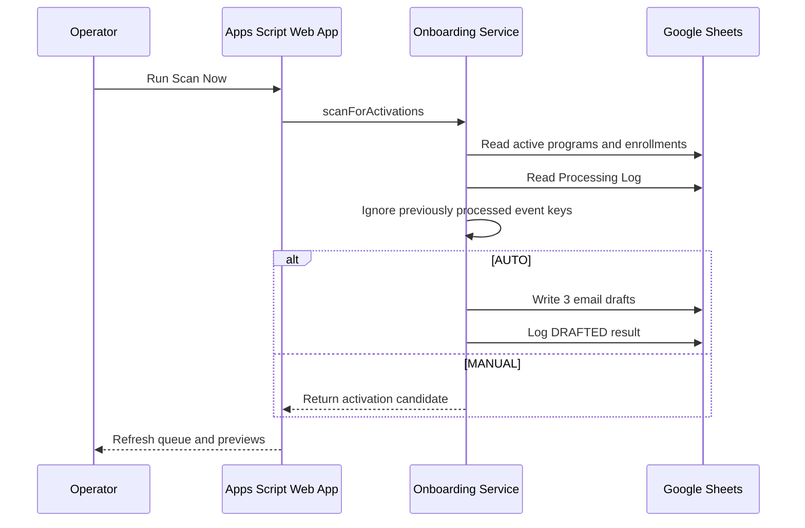

# Architecture

## Why this shape

The exercise needs a believable source of operational truth, activation logic, personalized content generation, and visible reasoning. Google Sheets plus Apps Script provides all four with very little infrastructure:

- **Google Sheets** simulates program, partner, and status data an operator could inspect directly.
- **Apps Script services** isolate persistence, activation detection, generation, and trigger management.
- **HTML Service web app** provides a real review experience without adding another hosting stack.

## Runtime flow



The installed clock trigger calls the same scan service every five minutes. The immediate button exists for demonstration and operator control, not as a separate logic path.

## Idempotency

Every activation event receives this key:

```text
{enrollment_id}|{date_status_changed}
```

Before generating, the service checks the Processing Log for a successful `DRAFTED` result with that key. Repeated scans therefore do not create duplicates. A later reactivation with a new status-change date is a new event.

## Service boundaries

- `Repository.gs` owns reads and writes.
- `OnboardingService.gs` owns event detection and orchestration.
- `EmailGenerator.gs` owns deterministic content assembly.
- `ProgramService.gs` and `PartnerService.gs` own operator mutations.
- `TriggerService.gs` owns installation and removal of the scheduled scan.
- `StateService.gs` assembles a client-friendly state object.

Email delivery is outside the prototype. In production, an approved draft could be handed to Gmail, an ESP, or a CRM sequence API behind a separate delivery service.

## Production hardening

Before production use, add identity and authorization, immutable event timestamps, input sanitization, monitoring, retry policy, API-backed partner/CRM sync, and automated tests against a staging spreadsheet.
