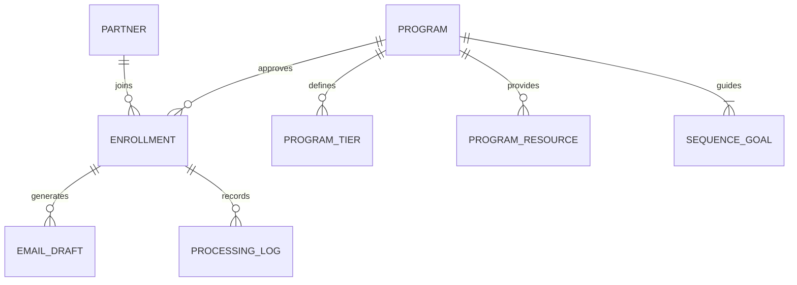

# Data model

The model separates company identity from program participation.

## Sheets

| Sheet | Purpose |
| --- | --- |
| Programs | Client context, voice, tracking template, mode, and lifecycle status |
| Program Tiers | Program-specific commission and bonus rules |
| Program Resources | Enablement, messaging, and portal links |
| Sequence Goals | Goal, key message, and desired outcome for each send day |
| Partners | Company and primary contact identity |
| Enrollments | Program-specific approval status, tier, link, and change date |
| Email Drafts | Generated subject/body plus reasoning and review state |
| Processing Log | Idempotency and lightweight operational history |

## Important invariants

- An enrollment belongs to exactly one partner and one program.
- Only an `ACTIVE` enrollment in an `ACTIVE` program can generate drafts.
- A program defines exactly three sequence steps for this exercise: Day 0, Day 3, and Day 7.
- `processing_mode` determines whether detection immediately drafts or waits for an operator.
- Draft approval changes review state only; it does not send email.
